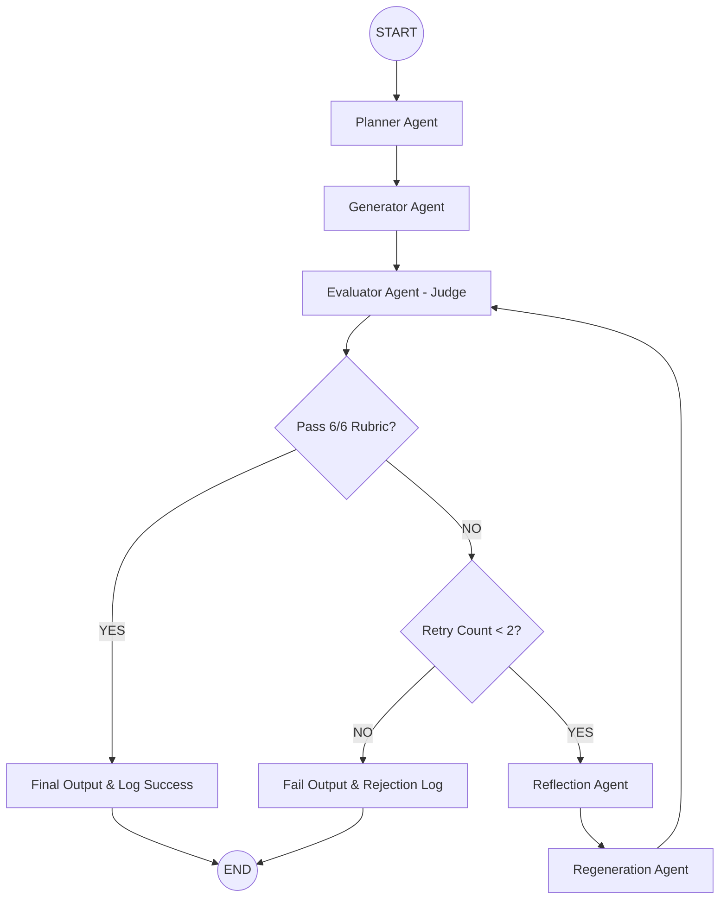

# RAG Lesson Generator 🎓🤖

A production-ready, self-evaluating content generation system powered by **LangGraph**, **Groq**, **Pydantic V2**, **aiosqlite**, and **FastAPI**.

Designed specifically to teach technical concepts to an Indian 12th-grade graduate (A2/B1 English level) through an autonomous cyclical self-correction pipeline.

---

## 🏗️ Architecture & LangGraph Workflow

The workflow loops autonomously until the drafted lesson either passes all 6 dimensions of the strict rubric or exhausts the retry limit (`MAX_RETRIES = 2`).



---

## 📋 The 6-Dimension Strict Rubric (Zero Partial Credit)

1. **Accuracy**: Factually and conceptually sound. Zero hallucinations.
2. **Beginner-Friendly**: A2/B1 CEFR English level, short sentences, suitable for 12th-grade Indian graduates.
3. **Example-Based**: Includes everyday relatable analogies (e.g. school library, open-book examination).
4. **Jargon Handling**: Technical terms (**Vector**, **Embedding**, **LLM**) must have immediate inline definitions in parentheses.
5. **Core Concepts**: Must explicitly teach **Retrieval**, **Augmentation**, and **Generation**.
6. **Teaching Flow**: Must follow the strict structure: `What` ➔ `Why` ➔ `How` ➔ `Everyday Example` ➔ `Summary`.

---

## 📁 Project Structure

```plaintext
rag_lesson_generator/
├── .env.example                # Template for OpenAI, LangSmith, and Logfire keys
├── requirements.txt            # Dependency specification
├── README.md                   # System documentation
├── tests/
│   └── test_workflow.py        # Rubric, routing, and memory tests
└── src/
    ├── __init__.py
    ├── main.py                 # FastAPI server & CLI runner
    ├── core/
    │   ├── config.py           # Pydantic Settings & environment
    │   ├── state.py            # LangGraph TypedDict GraphState
    │   └── schemas.py          # Pydantic models (Rubric, LessonPlan, RejectionLog)
    ├── agents/
    │   ├── planner.py          # Pedagogical curriculum outline planner
    │   ├── generator.py        # Lesson content creator (A2/B1 level)
    │   ├── evaluator.py        # Strict 6-dimension rubric judge
    │   ├── reflector.py        # Surgical failure diagnosis
    │   └── regenerator.py      # Targeted patch modifier
    ├── graph/
    │   └── workflow.py         # StateGraph compilation & conditional routing
    ├── memory/
    │   ├── database.py         # aiosqlite connection & schema initialization
    │   └── operations.py       # CRUD operations for learnings & rejection logs
    └── observability/
        ├── logger.py           # Logfire setup & unified logger
        └── langsmith_eval.py   # LangSmith benchmark evaluation script
```

---

## ⚡ Quickstart & Installation

### 1. Environment Setup
```bash
cd /home/hari-ronin/Documents/rag_lesson_generator

# Create and activate virtual environment
python3 -m venv venv
source venv/bin/activate

# Install dependencies
pip install -r requirements.txt
```

### 2. Configure Environment Variables
Copy `.env.example` to `.env` and set your API keys:
```bash
cp .env.example .env
```
Edit `.env`:
```ini
GROQ_API_KEY=gsk_...
GROQ_MODEL=llama-3.3-70b-versatile
MAX_RETRIES=2
DATABASE_URL=memory.db

# Observability (Optional)
LOGFIRE_TOKEN=
LANGCHAIN_TRACING_V2=false
LANGCHAIN_API_KEY=
LANGCHAIN_PROJECT=rag_lesson_generator
```

---

## 🚀 Execution Modes

### Mode 1: Interactive CLI
Generate a lesson directly in the terminal:
```bash
python -m src.main "Introduction to RAG (Retrieval-Augmented Generation)"
```

### Mode 2: FastAPI REST API
Start the server:
```bash
python -m src.main api
```
- **API Docs / Swagger UI**: [http://localhost:8000/docs](http://localhost:8000/docs)
- **POST `/generate`**:
  ```json
  {
    "topic": "Introduction to RAG"
  }
  ```
- **GET `/learnings`**: Inspect past failure modes and persistent knowledge stored in SQLite.
- **GET `/health`**: Health status.

### Mode 3: Run Unit Tests
```bash
pytest tests/ -v
```

### Mode 4: LangSmith Offline Dataset Evaluation
```bash
python -m src.observability.langsmith_eval
```
