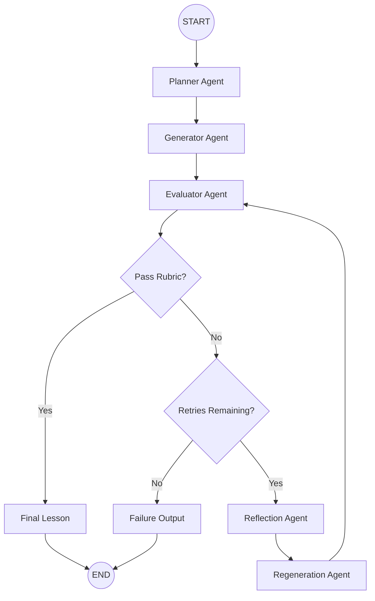

# RAG Lesson Generator 🎓🤖

A production-ready, self-evaluating lesson generation system built with **LangGraph**, **Groq LLMs**, **FastAPI**, **Pydantic V2**, and **SQLite**.

The system generates educational content for Indian 12th-grade graduates (A2/B1 English level) and automatically evaluates, reflects, and improves its output through a multi-agent feedback loop until it meets a strict teaching rubric.

---

## ✨ Features

* Multi-Agent Architecture using LangGraph
* Autonomous Self-Correction Workflow
* Structured Lesson Planning
* Reflection-Based Regeneration
* FastAPI REST API
* Persistent Memory with SQLite
* LangSmith Observability & Evaluation
* Type-Safe Development with Pydantic V2
* Async Database Operations using aiosqlite

---

## 🏗️ System Architecture

The workflow continuously improves generated lessons until they satisfy all rubric requirements or reach the configured retry limit.



---

## 🤖 Agent Responsibilities

| Agent       | Responsibility                               |
| ----------- | -------------------------------------------- |
| Planner     | Creates a structured lesson plan             |
| Generator   | Generates lesson content                     |
| Evaluator   | Scores lesson against rubric                 |
| Reflector   | Identifies weaknesses and failure reasons    |
| Regenerator | Improves lesson based on reflection feedback |

---

## 📋 Evaluation Rubric

The generated lesson must satisfy all of the following dimensions:

1. **Accuracy**

   * Factually correct
   * No hallucinated information

2. **Beginner Friendly**

   * A2/B1 English level
   * Suitable for Indian 12th-grade graduates

3. **Example Driven**

   * Uses simple and relatable real-world examples

4. **Jargon Explanation**

   * Technical terms must be immediately explained

5. **Core Concept Coverage**

   * Clearly explains:

     * Retrieval
     * Augmentation
     * Generation

6. **Teaching Flow**

   * What
   * Why
   * How
   * Everyday Example
   * Summary

---

## 📁 Project Structure

```text
rag_lesson_generator/
│
├── .env.example
├── README.md
├── requirements.txt
│
├── tests/
│   └── test_workflow.py
│
└── src/
    ├── main.py
    │
    ├── agents/
    │   ├── planner.py
    │   ├── generator.py
    │   ├── evaluator.py
    │   ├── reflector.py
    │   └── regenerator.py
    │
    ├── core/
    │   ├── config.py
    │   ├── schemas.py
    │   └── state.py
    │
    ├── graph/
    │   └── workflow.py
    │
    ├── memory/
    │   ├── database.py
    │   └── operations.py
    │
    └── observability/
        ├── logger.py
        └── langsmith_eval.py
```

---

## ⚙️ Tech Stack

| Category               | Technology  |
| ---------------------- | ----------- |
| Workflow Orchestration | LangGraph   |
| LLM Provider           | Groq        |
| API Framework          | FastAPI     |
| Validation             | Pydantic V2 |
| Database               | SQLite      |
| ORM / Async DB         | aiosqlite   |
| Testing                | Pytest      |
| Observability          | LangSmith   |

---

## 🚀 Getting Started

### 1. Clone Repository

```bash
git clone <repository-url>
cd rag_lesson_generator
```

### 2. Create Virtual Environment

Using Python:

```bash
python -m venv venv
source venv/bin/activate
```

Or using Conda:

```bash
conda create -n rag_lesson_generator python=3.11
conda activate rag_lesson_generator
```

### 3. Install Dependencies

```bash
pip install -r requirements.txt
```

---

## 🔐 Environment Variables

Create a `.env` file:

```bash
cp .env.example .env
```

Example configuration:

```env
GROQ_API_KEY=gsk_xxxxxxxxxxxxx

GROQ_MODEL=llama-3.3-70b-versatile

MAX_RETRIES=2

DATABASE_URL=memory.db

LANGSMITH_TRACING=true
LANGSMITH_API_KEY=lsv2_xxxxxxxxx
LANGSMITH_PROJECT=RAG_Lesson_Generator
```

---

## ▶️ Running the Application

### CLI Mode

Generate a lesson directly from the terminal:

```bash
python -m src.main "Introduction to RAG"
```

---

### FastAPI Mode

Start the API server:

```bash
uvicorn src.main:api --host 0.0.0.0 --port 8000 --reload
```

Access:

* Swagger UI: http://localhost:8000/docs
* OpenAPI Schema: http://localhost:8000/openapi.json

---

## 📡 API Endpoints

### Generate Lesson

**POST** `/generate`

Request:

```json
{
  "topic": "Introduction to RAG"
}
```

Response:

```json
{
  "lesson": "...generated content..."
}
```

---

### Retrieve Learnings

**GET** `/learnings`

Returns stored reflections, rejection logs, and improvement history.

---


## 🧪 Running Tests

```bash
pytest tests -v
```

---

## 📊 LangSmith Evaluation

Run offline evaluation against your benchmark dataset:

```bash
python -m src.observability.langsmith_eval
```

---

## 🎯 Use Cases

* AI-Powered Educational Assistants
* Personalized Learning Systems
* Self-Evaluating Agent Workflows
* Reflection-Based Content Generation
* Multi-Agent LangGraph Applications

---

## 📄 License

MIT License

```

Built for experimentation with autonomous agentic workflows, self-correction loops, and educational content generation.
```
